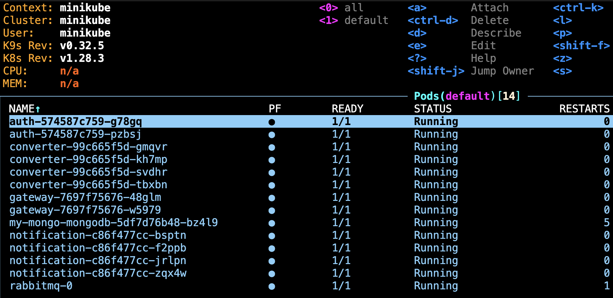
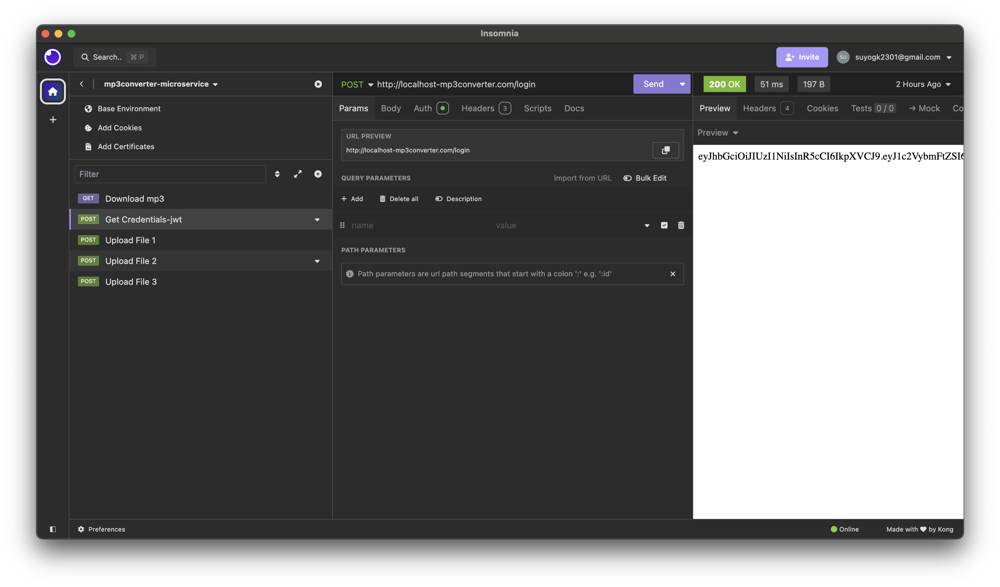
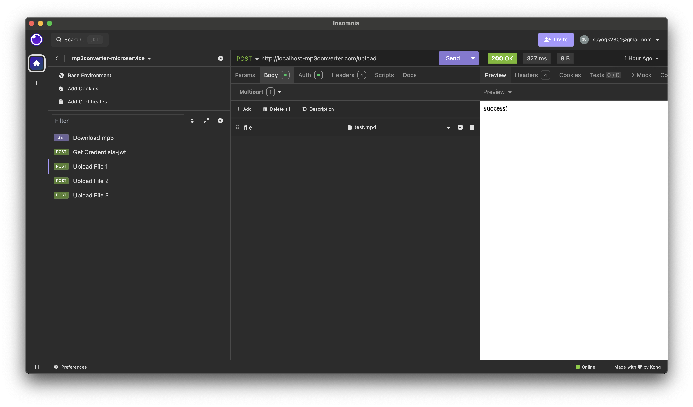
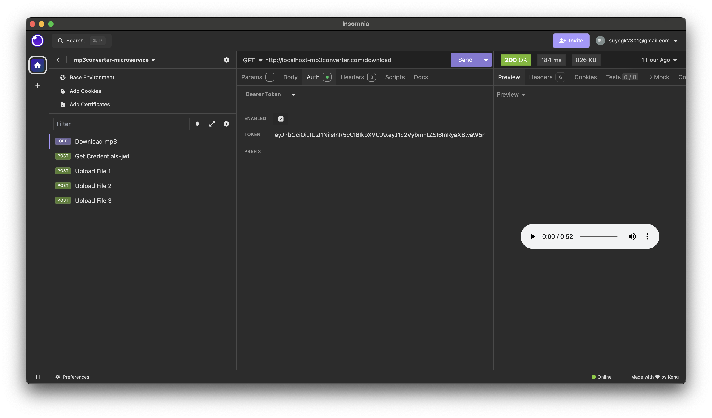

# Video to MP3 Converter Microservices Application

This project is a microservices-based application that converts video files to MP3 format. It uses Python, RabbitMQ, MongoDB, Docker, Kubernetes, and MySQL, with JWT-based authentication and asynchronous communication between services.

## Features
- Video upload and MP3 conversion
- Asynchronous service communication with RabbitMQ
- JWT-based authentication for secure access
- Scalable and containerized services using Docker and Kubernetes
- MongoDB for file storage
- Notification service that sends email when the MP3 file is ready

## Architecture Overview
The application follows a microservices architecture, where each service is independently deployable and responsible for a specific function:
- **API Gateway**: Entry point for all user requests.
- **Auth Service**: Handles user authentication using JWT.
- **Video-to-MP3 Converter Service**: Converts uploaded videos to MP3 format.
- **Notification Service**: Sends email notifications when the conversion is complete.
- **RabbitMQ**: Facilitates asynchronous communication between services.
- **MongoDB**: Stores video and MP3 files.
- **MySQL**: Stores user credentials for the Auth service.

## Prerequisites
- Docker
- Kubernetes (Minikube recommended for local development)
- Python 3.10
- RabbitMQ
- MongoDB
- MySQL

## Running necessary services
1. **Start Minikube**:
    - docker
    - kubernetes
   ```bash
   minikube start
   minikube tunnel
    ```
    - run init.sql in your local sql instance

## Installation

1. **Clone the Repository and then:**
    - change dir:
    ```bash
    cd python/src
    ```
2. **Build Docker Images and push to your dockerhub repository**:
    - build:
    ```bash
    docker build -t ./auth
    docker build -t ./converter
    docker build -t ./notification
    docker build -t ./gateway
    ```
    - tag all builds to repository name
    - push (repeat this for all of the docker images):
    ```bash
    docker push <your repository name>
    ```

3. **Deploy Services to Kubernetes**:
    ```bash
    kubectl apply -f ./auth/manifest
    kubectl apply -f ./converter/manifest
    kubectl apply -f ./notification/manifest
    kubectl apply -f ./rabbit/manifest
    kubectl apply -f ./gateway/manifest
    ```

# curl commands for testing

- Get jwt token:
```
curl --request POST \
  --url http://localhost-mp3converter.com/login \
  --header 'Authorization: Basic <Base64 encoded username and password>' \
```


- Upload:
```
curl --request POST \
  --url http://localhost-mp3converter.com/upload \
  --header 'Authorization: Bearer <jwt> \
  --header 'Content-Type: multipart/form-data' \
  --form file=@/path/to/video.mp4
```


- Download:
```
curl --request GET \
--url 'http://localhost-mp3converter.com/download?fid=6706af7defdd8973ea4fe3d1' \
--header 'Authorization: Bearer <jwt> 
```

# Container deployment in k9s:




# Testing images:

- getting jwt token:


- uploading video:


- uploading audio:

